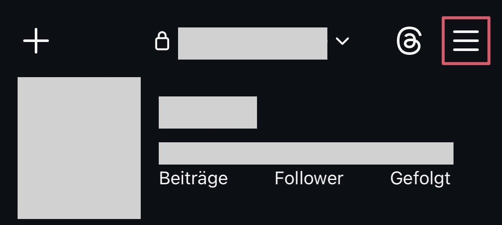
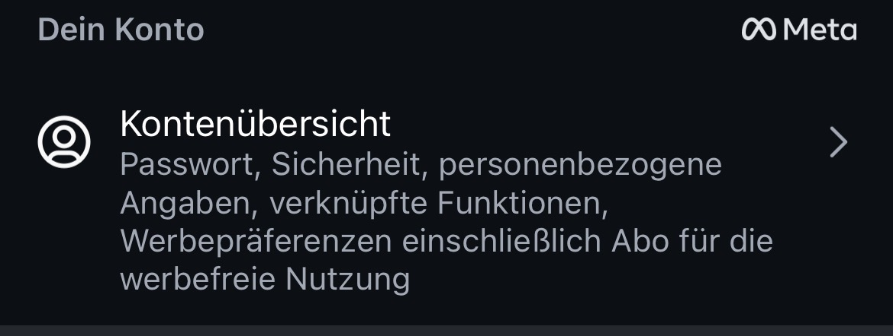
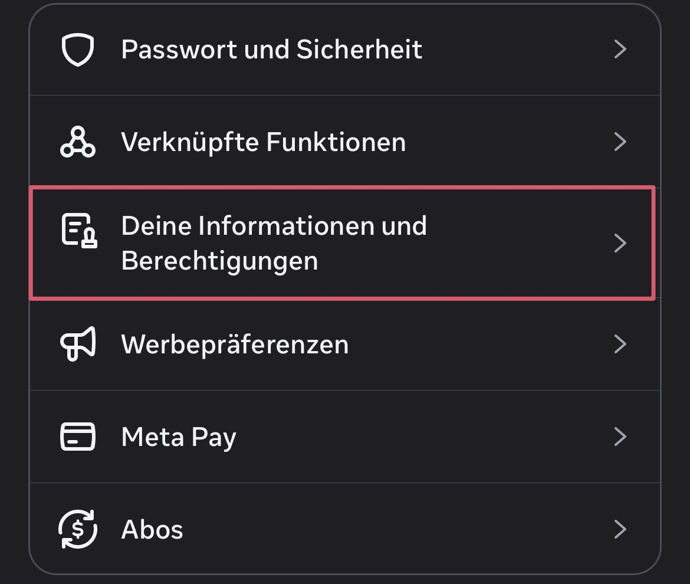
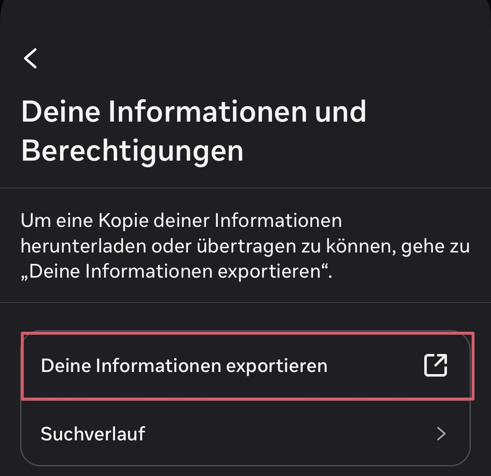
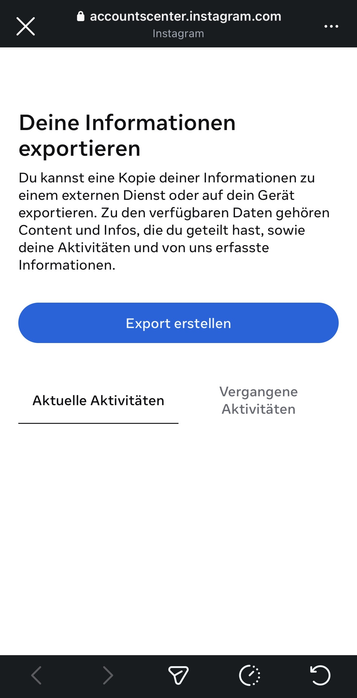
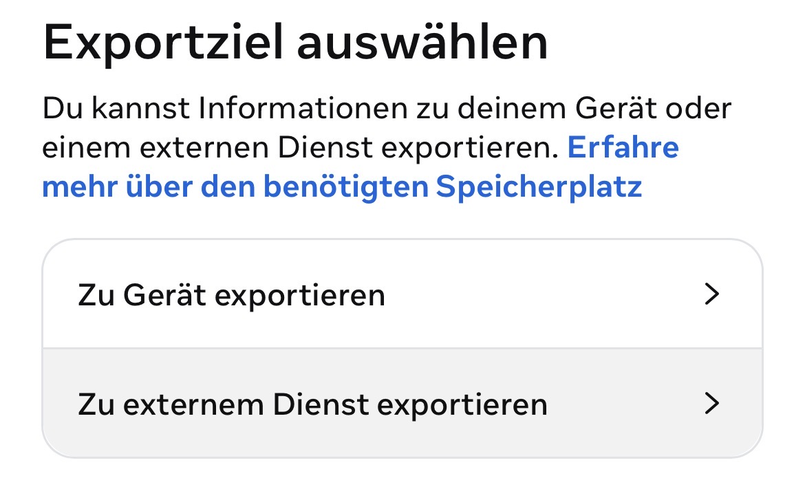
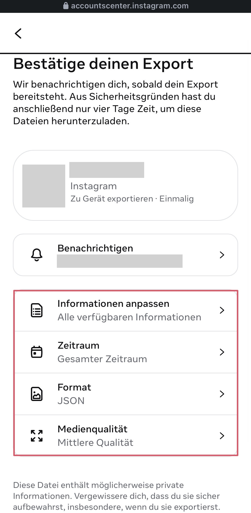
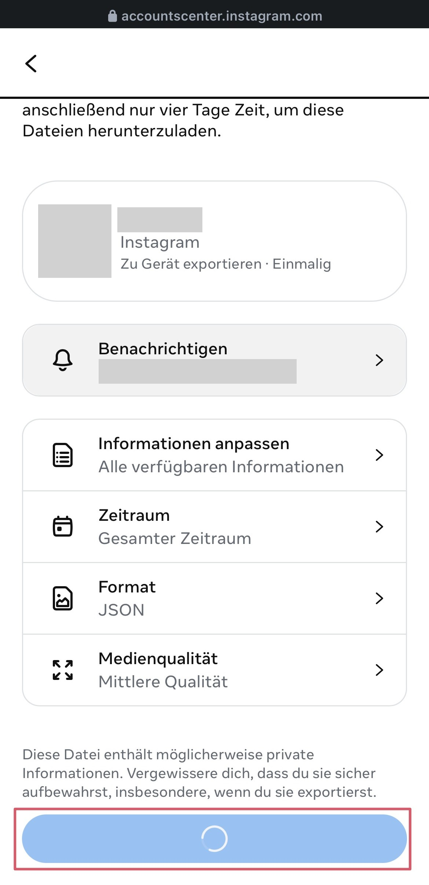
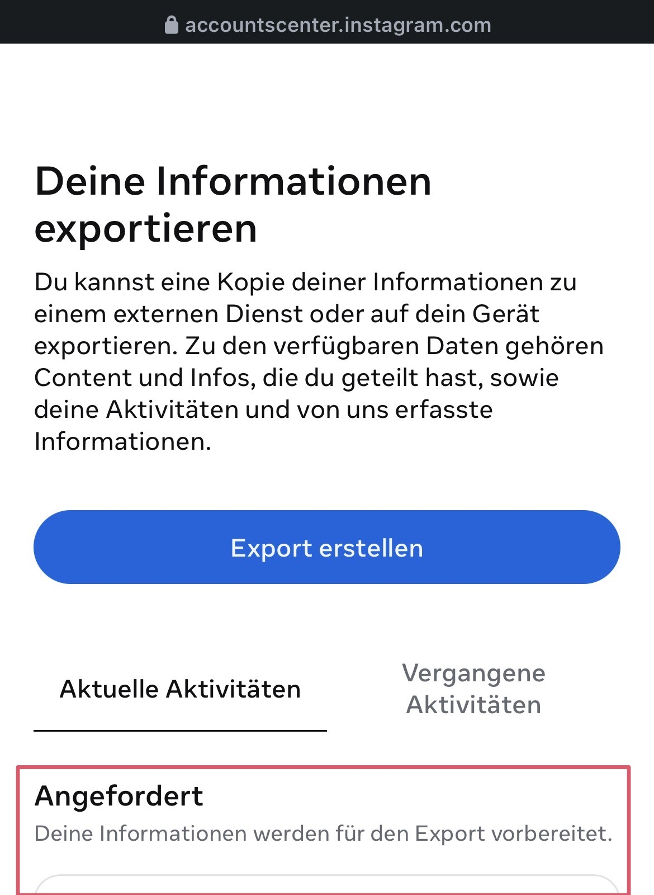
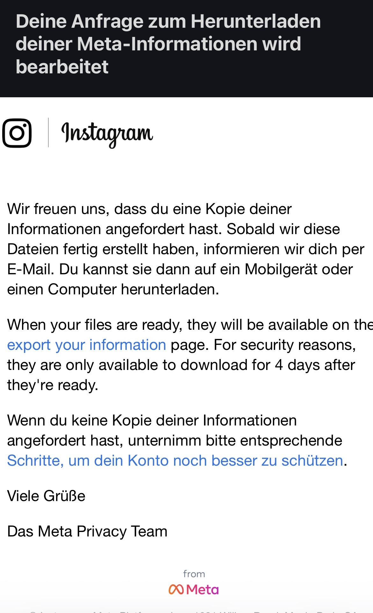

# Instagram-Analyzer

This is a lightweight, privacy-focused Python tool that can analyze Instagram data, such as the follower-to-following ratio, without requiring you to share your credentials. All you need to do is manually export the data using Instagram's built-in functionalities, and then let this tool work its magic on the data.

This tool only provides data analysis. It does not perform actions such as unfollowing or allow you to perform actions directly on your account. If you want to take action after reviewing the results, you need to go to Instagram and do so manually!

## Why this tool?

Most Instagram analyzer apps require your login information and only offer limited free options. Sometimes, all you want to know is basic information, and that's where this tool comes in!

==> TODO...

## Getting started

This project uses **uv** for dependency management.

```bash
# Clone the repository
git clone https://github.com/piology-1/IG-Tool
cd IG-Tool

# Install dependencies
uv sync
```

Run the analysis:

```bash
uv run .\src\main.py
```

## How to get your data

The project includes an example `following.json` and `followers_1.json` for demonstration purposes. To analyze your own account, follow these steps to export your data from Instagram:

### Step-by-Step Instructions

> [!NOTE]  
> Depending on your Instagram version and platform (Web, PC, Mobile), the UI might differ slightly. The screenshots below show the process in German (e.g. "Kontoübersicht"), but the steps remain the same.

1. **Open Settings**  
   Go to your profile and tap the **three lines (menu)** in the top right corner.  
   

2. **Access Accounts Center**  
   Tap on **Accounts Center** (German: _Kontoübersicht_).  
   

3. **Information and Permissions**  
   Select **Your information and permissions** (German: _Deine Informationen und Berechtigungen_).  
   

4. **Export Your Information**  
   Select **Export your information** (German: _Deine Informationen exportieren_). You will be redirected to the Meta download center.  
   

5. **Start Export**  
   Tap the blue button **Generate export** (German: _Export erstellen_).
   You can also see your current and past activities underneath. These might include past exports or other actions you have performed.  
   

6. **Choose Destination**  
   Select **Download to device** (German: _Zu Gerät exportieren_).  
   

7. **Configure Export Settings (Crucial!)**  
   Adjust your settings as follows to ensure the tool works correctly:
   - **Information:** Click on "Select information" and choose data such as **"Followers and Following"**.
     > [!WARNING]  
     > If you leave it at "All available information" (as shown in the screenshot), the export will take a significantly longer time and include large amounts of data that you may not need.
   - **Time Range:** Select **"All time"** (German: _Gesamter Zeitraum_).
   - **Format:** Select **"JSON"**.
   - **Media Quality:** Medium or Low is sufficient.  
     

8. **Submit Request**  
   Press the blue **Start export** button at the bottom and wait a moment.  
   

9. **Pending Request**  
   You will return to the overview screen. Your export will show as **Pending** under your current activities.  
   

10. **Download and Extract**  
    You will receive a confirmation email once the export has started. Depending on the amount of data requested, the processing time may vary.  
    _Note: If you ignored the warning and selected "All available information", this process may take several hours or even days._  
    

11. Once your data is ready, you will receive an email notification. Download and extract the ZIP file.
    > [!IMPORTANT]  
    > You must place the `.json` files directly into the `data/` folder so the tool can find them!

## Features

- List people who don't follow you back
- ...

## Future improvements

In the future, maybe a look at the [Instagram API](https://developers.facebook.com/docs/instagram-platform) could be interessting.

## License & Disclaimer

This tool is for educational purposes only. It is not affiliated with, authorized, maintained, sponsored, or endorsed by Instagram or Meta.
